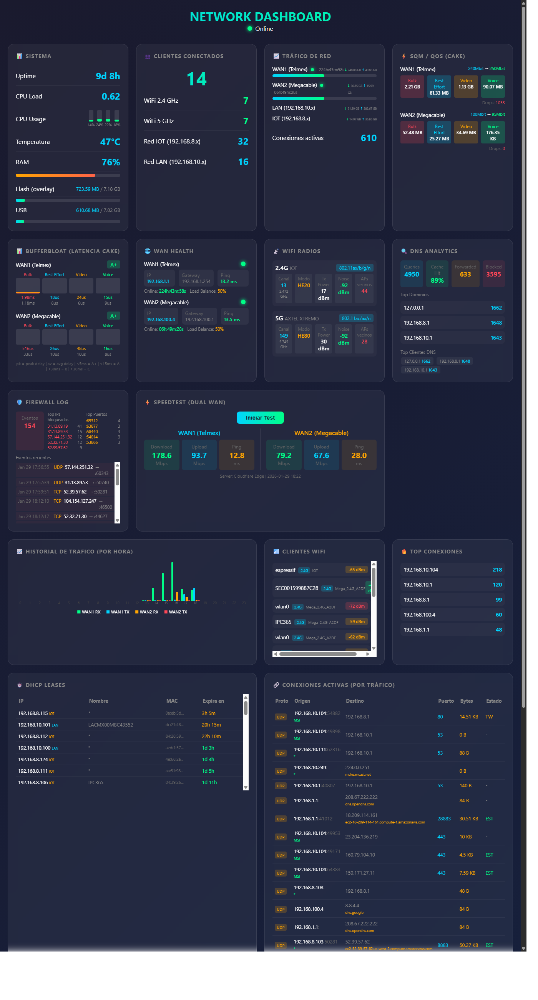

# OpenWrt Network Dashboard

Real-time network monitoring dashboard for OpenWrt routers with dual WAN, SQM/CAKE bufferbloat metrics, and 15+ panels.

Built for **GL.iNet GL-MT6000** (MediaTek MT7986) running **OpenWrt 24.10.4**, but adaptable to other OpenWrt devices.

 



## Features

| Panel | Description |
|-------|-------------|
| **System** | Uptime, CPU usage (per-core real-time delta), temperature, RAM, Flash/USB storage |
| **Clients** | WiFi 2.4G/5G count, DHCP leases per VLAN (IOT/LAN) |
| **Traffic** | RX/TX bytes per interface with WAN status and uptime |
| **SQM / QoS (CAKE)** | Bandwidth, capacity estimate, per-tin traffic (Bulk/BE/Video/Voice), drops |
| **Bufferbloat** | CAKE peak/avg delay per tin with visual bars and A+/A/B/C grading |
| **WAN Health** | IP, gateway, ping latency, mwan3 status and load balance % per WAN |
| **WiFi Radios** | Channel, frequency, HT mode, TX power, noise floor, neighbor APs |
| **DNS Analytics** | Total queries, cache hit rate, forwarded, blocked, top domains, top clients |
| **Firewall Log** | Dropped/rejected events, top blocked IPs, top ports, recent events |
| **Speedtest** | On-demand dual-WAN speed test (DL/UL/Ping) via Cloudflare Edge |
| **Traffic History** | Hourly bar chart (24h) with RX/TX per WAN interface |
| **WiFi Clients** | Connected devices with signal strength and band |
| **Top Connections** | Clients ranked by active connection count |
| **DHCP Leases** | Full lease table with expiry countdown |
| **Active Connections** | Conntrack table with DNS-resolved hostnames |

## Architecture

```
Browser                    OpenWrt Router
  |                            |
  |  GET /dashboard.html       |
  |--------------------------->|  /www/dashboard.html (single-file HTML/CSS/JS)
  |                            |
  |  GET /cgi-bin/dashboard_api.sh  (every 3s)
  |--------------------------->|  /www/cgi-bin/dashboard_api.sh (shell CGI → JSON)
  |  <-- JSON response -----  |
  |                            |
  |  GET /cgi-bin/speedtest_trigger.sh  (on button click)
  |--------------------------->|  Triggers /usr/bin/run_speedtest.sh in background
  |                            |
  |                            |  /usr/bin/traffic_history.sh (hourly cron)
```

## Files

| File | Router Path | Description |
|------|-------------|-------------|
| `dashboard.html` | `/www/dashboard.html` | Single-file dashboard (HTML + CSS + JS) |
| `dashboard_api.sh` | `/www/cgi-bin/dashboard_api.sh` | CGI backend - collects all metrics as JSON |
| `speedtest_trigger.sh` | `/www/cgi-bin/speedtest_trigger.sh` | CGI endpoint to trigger speed test |
| `run_speedtest.sh` | `/usr/bin/run_speedtest.sh` | Curl-based speed test for both WAN interfaces |
| `traffic_history.sh` | `/usr/bin/traffic_history.sh` | Hourly traffic delta logger |

## Installation

```bash
# Copy files to router
scp dashboard.html root@192.168.8.1:/www/dashboard.html
scp dashboard_api.sh root@192.168.8.1:/www/cgi-bin/dashboard_api.sh
scp speedtest_trigger.sh root@192.168.8.1:/www/cgi-bin/speedtest_trigger.sh
scp run_speedtest.sh root@192.168.8.1:/usr/bin/run_speedtest.sh
scp traffic_history.sh root@192.168.8.1:/usr/bin/traffic_history.sh

# Set permissions
ssh root@192.168.8.1 'chmod +x /www/cgi-bin/dashboard_api.sh /www/cgi-bin/speedtest_trigger.sh /usr/bin/run_speedtest.sh /usr/bin/traffic_history.sh'

# Add hourly cron for traffic history
ssh root@192.168.8.1 'echo "0 * * * * /usr/bin/traffic_history.sh" >> /etc/crontabs/root && /etc/init.d/cron restart'

# Enable DNS query logging (needed for DNS analytics and hostname resolution)
ssh root@192.168.8.1 'uci set dhcp.@dnsmasq[0].logqueries="1" && uci commit dhcp && /etc/init.d/dnsmasq restart'

# Enable firewall logging (needed for firewall panel)
ssh root@192.168.8.1 'uci set firewall.@zone[1].log="1" && uci set firewall.@zone[1].log_limit="60/minute" && uci commit firewall && fw4 reload'
```

Access at: `http://192.168.8.1/dashboard.html`

## Requirements

- OpenWrt 24.10+ (tested on 24.10.4)
- `curl` with HTTPS support (for speedtest)
- `tc` (for SQM/CAKE metrics)
- `mwan3` (for dual WAN status, optional)
- `dnsmasq` with `logqueries` enabled (for DNS analytics)
- SQM with CAKE qdisc (for bufferbloat metrics, optional)

## Customization

The dashboard is designed for a dual-WAN setup with these interfaces:

| Interface | Role |
|-----------|------|
| `eth1` | WAN1 (Telmex) |
| `lan5` | WAN2 (Megacable) |
| `br-lan` | LAN (192.168.10.x) |
| `br-lan.8` | IOT VLAN (192.168.8.x) |

To adapt to your setup, edit the interface names in `dashboard_api.sh`.

## License

MIT
